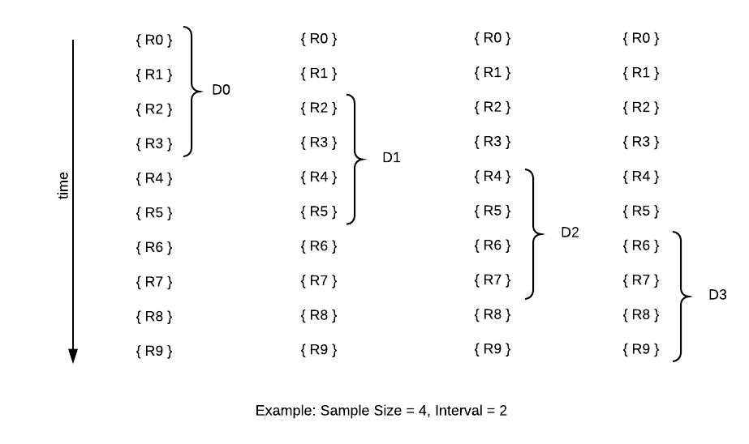

## Welcome to the IoT Code Challenge!

We have a customer that wants to gain insights from their fleet of weather sensors. These sensors currently don't have the ability
to connect to the internet. The sensors do have the ability to log data to `.csv` files, and the customer would like us
to build a tool to read these files, and send data readings and diagnostic data over a secure connection established with AWS IoT.
For this challenge, you will be building this tool.

This is your private repo. This is where you will commit and push
 your source code, unit tests, and instructions for how to build, test, and run your solution to this challenge. Keep
 in mind we will test your application with various inputs, not just what is provided in this repository. 

You will receive AWS login credentials for an AWS account that contains resources you will need to complete this task. 
The account contains a pre-registered AWS IoT Thing called 'thing-for-tmert1012' that has been setup for you. This repository
contains the keys, certificates, and configuration values needed to connect to the 'thing-for-tmert1012', described in more 
detail in the following sections. 
  

## Instructions
1. Create an application per the requirements specified below using one of the available [AWS IoT Device SDKs](https://docs.aws.amazon.com/iot/latest/developerguide/iot-sdks.html) for the interface to AWS IoT. These are available for C++, Arduino, Embedded C, Java, Javascript, and Python. There are Mobile SDKs for Android and iOS, but this challenge was not specifically designed for a mobile client, so we strongly suggest picking another language. If you are not familiar with any of these languages, please let us know so we can make recommendations on how to proceed.
1. You should not need to configure anything further in AWS, those steps are done for you.
1. Commit and push to this repository your source code, unit tests, and instructions for how to build, test, and run your application.
1. Document assumptions you make during implementation in code comments. These will serve as points of discussion about your solution.


## Connecting to the AWS IoT Thing:
1. Login to the AWS console with your provided credentials. You may be prompted to reset your password on login.
1. Be sure you select 'US East (N. Virginia)' for the region in the upper right corner of the console
1. Under the 'Services' dropdown, navigate to ‘AWS IoT Core'. You may need to click 'Get Started' if you don't see the left hand navigation menu.
1. Select ‘Manage' from the left hand navigation menu, and you should see a Thing called 'thing-for-tmert1012'
1. Select 'thing-for-tmert1012', and you will see the details of the Thing. To save time, we've included a [configuration values file](configuration-values.md)
that contains all of the values you will need to connect to this thing using the AWS IoT SDK. The SDK documentation will describe how to establish the connection programmatically using these values.
1. The requirements specify two MQTT topics: `things/thing-for-tmert1012/diagnostics` and `things/thing-for-tmert1012/readings`. Note that you do not need to do anything to create the topics in AWS IoT, topics are created dynamically by AWS when a client sends data to a new topic.
1. Prioritize a working algorithm over connectivity to AWS IoT. We would rather see a working algorithm with printouts to standard out than have a working AWS IoT connection without a working algorithm.


## Requirements


1. Accept input readings defined in CSV file similar to the example [data file](data/readings.csv). One invocation of the tool will read and process a single csv file, there is no need to 'listen' for updates made to the file after invocation.
1. Report readings to AWS IoT using the MQTT topic `things/thing-for-tmert1012/readings`. 
1. Report each reading as a JSON structure:
    ```json
    {
      "timestamp": 1535324228266,
      "temperature": 19.15,
      "humidity": 0.20,
      "pressure": 37.11
    }
    ```
1. Provide a user configurable way to set the filename to use as input.
1. Provide a user configurable way to set the sample size window, which specifies the number of readings included in each diagnostics report. (Ex. last 4 readings).
1. Provide a user configurable way to set the report interval, which specifies how often the report should be generated (Ex. every 2 readings)

    

    *The above example shows a few successive diagnostics reports D0-D3 generated over successive readings R0-R9*  

1. Only generate diagnostics reports once enough readings have been accumulated to fill a sample size window.
1. Compute and report diagnostic data using the MQTT topic `things/thing-for-tmert1012/diagnostics`
1. Diagnostics data shall include the min, max, and average values for a sample
1. Diagnostics data shall include the latest timestamp of the readings used in the report and also be reported in a JSON structure:
   ```json
   {
      "timestamp": 1535324228266,
      "min-temperature": 10.11,
      "max-temperature": 19.15,
      "avg-temperature": 25.11,
      "min-humidity": 0.11,
      "max-humidity": 0.20,
      "avg-humidity": 0.72,
      "min-pressure": 25.32,
      "max-pressure": 37.11,
      "avg-pressure": 121.88
   }
   ```

## End to End Test using AWS IoT Console
1. In the AWS IoT Core console, select 'Test' in the left navigation list
1. Input the topic to watch 'things/thing-for-tmert1012/readings’ or 'things/thing-for-tmert1012/diagnostics’, start your application and if everything is connected, you will see your data
